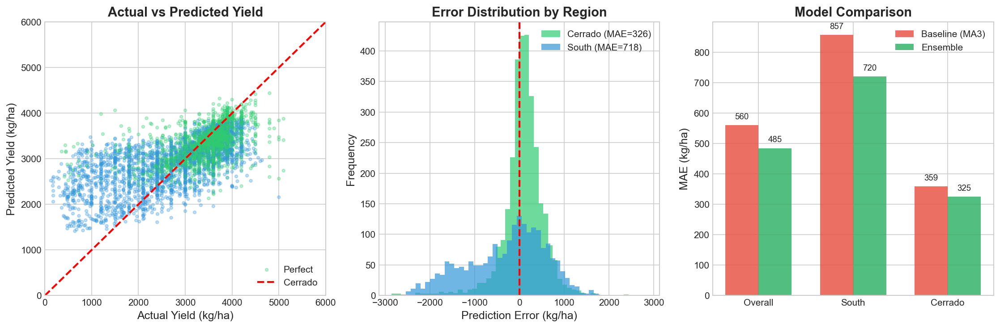
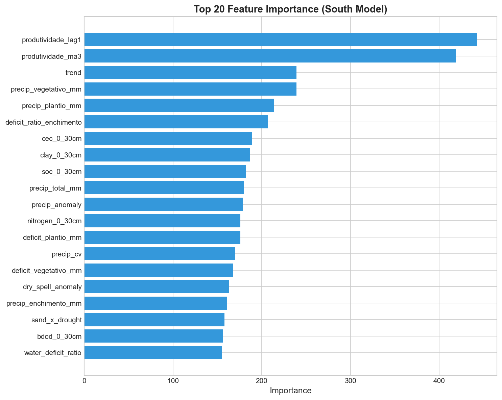

# Brazil Soybean Yield Forecast


## TL;DR

**Problem:** Agricultural cooperatives and credit banks need accurate municipality-level soybean yield estimates for crop insurance pricing, credit limits, and early warning of problematic harvests — but currently rely on subjective estimates or historical averages that ignore climate and regional variations.

**Solution:** End-to-end ML pipeline combining public data (IBGE, NASA POWER, MODIS NDVI) to predict yield in kg/ha with **MAE of 485 kg/ha (~8 bags/ha)**, calibrated confidence intervals, and automatic translation to credit risk language.

**Key Features:**
- Regional models (South vs Cerrado) — 16% more accurate in South where La Niña causes more damage
- Ensemble of LightGBM + XGBoost with weighted averaging
- 94 engineered features including ETo, water deficit, NDVI, and climate interactions
- Interactive Streamlit dashboard for municipality analysis


## What's New in v2.0

### Model Improvements
| Change | Before | After | Impact |
|--------|--------|-------|--------|
| **Architecture** | Single LightGBM | Ensemble (LightGBM + XGBoost) | More robust predictions |
| **Regional Split** | One model for all | South vs Cerrado specialized | +16% accuracy in South |
| **Features** | 79 features | 94 features (+15 new) | Better signal capture |
| **MAE** | 532 kg/ha | 485 kg/ha | **-13.5% error** |

### New Features Added
- **Evapotranspiration (ETo)**: Hargreaves-Samani method using temperature data
- **Water Deficit by Phase**: `deficit_plantio`, `deficit_vegetativo`, `deficit_enchimento`
- **Climate Interactions**: `la_nina_x_deficit`, `terminal_drought_stress`, `awc_x_deficit`, `sand_x_deficit`

### New Data Sources
- **NASA POWER Radiation**: Solar radiation (ALLSKY_SFC_SW_DWN) for 2,763 municipalities
- **NASA POWER Wind**: Wind speed (WS2M) for Penman-Monteith ETo
- **MODIS NDVI**: Vegetation index via Google Earth Engine for 819 municipalities (30% coverage)

### NDVI Integration (Google Earth Engine)
Successfully integrated MODIS MOD13Q1 NDVI data:
- 819 municipalities with NDVI features
- 26 years of data (2000-2025)
- Features: `ndvi_mean_safra`, `ndvi_max_safra`, `ndvi_amplitude`, `ndvi_plantio`, `ndvi_vegetativo`, `ndvi_enchimento`
- Impact with 30% coverage: minimal (+0.04% MAE reduction)
- Full coverage would likely improve results by 2-5%

### Infrastructure
- **CI/CD**: GitHub Actions pipeline with linting, tests, and build checks
- **Pipeline Script**: `run_improvements.py` for easy reproduction
- **Caching**: Incremental data downloads with resume capability

---

## Results



### Model Performance vs Baseline

| Model | MAE (kg/ha) | MAE (bags/ha) | vs Baseline |
|-------|-------------|---------------|-------------|
| 3-Year Moving Average (MA3) | 560.1 | 9.3 | baseline |
| **Regional Ensemble** | **484.8** | **8.1** | **-13.5%** |

### Performance by Region

| Region | Baseline MAE | Ensemble MAE | Improvement |
|--------|--------------|--------------|-------------|
| **South** (RS, PR, SC) | 856.7 kg/ha | 718.2 kg/ha | **16.2%** |
| **Cerrado** (MT, GO, MS, etc.) | 358.8 kg/ha | 326.4 kg/ha | **8.8%** |
| **Combined** | 560.1 kg/ha | 484.8 kg/ha | **13.5%** |

*Test set: 5,125 municipality-year observations (2022-2023 harvest seasons)*

**Why is South MAE higher?**
The 2022 test period coincides with a severe La Niña event that caused historic yield losses in Rio Grande do Sul. The regional model with higher regularization still outperforms the baseline by 16%.

### Feature Importance



---

## Quick Start

pip install -r requirements.txt
pip install pyyaml  # if yaml error

**Note:** Large climate files (`climate_daily.parquet`, ~550MB) are not included in the repo.

**Run** `python run_improvements.py --climate` to generate them, or use the pre-processed `dataset_final.parquet` for quick testing.

### Option 1: Quick Run (uses existing processed data)
```bash
git clone https://github.com/yourusername/Brazil-Soybean-Forecast.git
cd Brazil-Soybean-Forecast

python -m venv venv
venv\Scripts\activate  # Windows
# source venv/bin/activate  # Linux/Mac

pip install -r requirements.txt

python run_improvements.py --quick
```

### Option 2: Full Pipeline (downloads fresh data)
```bash
# Download additional climate data (radiation, wind speed)
python run_improvements.py --climate

# Rebuild features and train ensemble
python run_improvements.py --features --train --evaluate
```

### Run Dashboard
```bash
streamlit run app/dashboard.py
```

---

## Architecture

```
Brazil-Soybean-Forecast/
├── data/
│   ├── raw/                    # Raw data from APIs (cached)
│   │   ├── climate/            # NASA POWER daily climate
│   │   ├── climate_extra/      # Radiation & wind (optional)
│   │   └── ndvi_gee/           # MODIS NDVI (optional)
│   └── processed/              # Feature-engineered datasets
│       ├── climate_daily.parquet
│       ├── soil_municipalities.parquet
│       ├── target_soja.parquet
│       └── dataset_final.parquet
├── src/
│   ├── ingest/                 # Data ingestion modules
│   │   ├── climate_nasa.py     # NASA POWER API client
│   │   ├── climate_update.py   # Radiation/wind downloader
│   │   ├── ndvi_gee.py         # Google Earth Engine NDVI
│   │   ├── soil_embrapa.py     # EMBRAPA soil data
│   │   └── target_pam.py       # IBGE crop production
│   ├── validation/             # Data quality contracts
│   ├── features/
│   │   └── build_features.py   # Feature engineering (93 features)
│   ├── modeling/
│   │   ├── train.py            # Single model training
│   │   └── ensemble.py         # Regional ensemble
│   ├── evaluation/             # Metrics and analysis
│   ├── inference/              # Prediction pipeline
│   ├── monitoring/             # Drift detection
│   └── business/               # Risk translation
├── models/                     # Trained model artifacts
│   └── ensemble_regional/      # LightGBM + XGBoost by region
├── results/                    # Evaluation outputs
├── app/
│   └── dashboard.py            # Streamlit dashboard
├── configs/                    # YAML configurations
├── run_improvements.py         # Main pipeline script
└── requirements.txt
```

---

## Features (93 total)

### Climate Features (by phenological phase)
| Category | Count | Examples |
|----------|-------|----------|
| Temperature | 12 | `temp_mean_plantio`, `temp_range_vegetativo`, `hot_days_enchimento` |
| Precipitation | 15 | `precip_total_safra`, `dry_spell_max`, `consecutive_dry_days` |
| Evapotranspiration | 6 | `eto_hargreaves`, `eto_vegetativo`, `eto_enchimento` |
| Water Balance | 9 | `deficit_plantio`, `deficit_vegetativo`, `deficit_enchimento` |

### Soil Features
| Feature | Description |
|---------|-------------|
| `sand_content`, `clay_content` | Texture composition |
| `ph_water` | Soil acidity |
| `organic_carbon` | Organic matter content |
| `awc` | Available Water Capacity |
| `cec` | Cation Exchange Capacity |

### Temporal & Interaction Features
| Feature | Description |
|---------|-------------|
| `produtividade_lag1` | Previous year yield |
| `produtividade_ma3` | 3-year moving average |
| `la_nina_x_deficit` | La Niña impact on water stress |
| `terminal_drought_stress` | Late-season drought indicator |
| `awc_x_deficit` | Soil buffer during drought |

---

## Model Details

### Regional Ensemble Architecture

```
                    ┌─────────────────┐
                    │   Input Data    │
                    │  (93 features)  │
                    └────────┬────────┘
                             │
              ┌──────────────┴──────────────┐
              │                             │
              ▼                             ▼
    ┌─────────────────┐           ┌─────────────────┐
    │   South Model   │           │  Cerrado Model  │
    │  (PR, SC, RS)   │           │ (MT, GO, MS...) │
    │                 │           │                 │
    │ LightGBM (53%)  │           │ LightGBM (53%)  │
    │ XGBoost  (47%)  │           │ XGBoost  (47%)  │
    │                 │           │                 │
    │ Higher L2 reg   │           │ Standard params │
    │ Fewer leaves    │           │                 │
    └────────┬────────┘           └────────┬────────┘
             │                             │
             └──────────────┬──────────────┘
                            ▼
                   ┌─────────────────┐
                   │   Predictions   │
                   │    (kg/ha)      │
                   └─────────────────┘
```

### Why Regional Models?

1. **Climate Variability**: South Brazil experiences higher inter-annual variability due to La Niña/El Niño effects
2. **Different Yield Distributions**: Cerrado has higher, more stable yields; South has wider range
3. **Specialized Regularization**: South model uses stronger regularization to handle outliers from extreme events

---

## Data Sources

| Source | Data | Granularity | Auth Required |
|--------|------|-------------|---------------|
| [IBGE/SIDRA](https://sidra.ibge.gov.br/) | Soybean production | Municipality × Year | No |
| [NASA POWER](https://power.larc.nasa.gov/) | Daily climate | Point × Day | No |
| [EMBRAPA HYBRAS](https://www.embrapa.br/) | Soil properties | Municipality | No |
| [NOAA ONI](https://www.cpc.ncep.noaa.gov/) | El Niño/La Niña index | Monthly | No |

---

## Train/Test Split

| Set | Years | Samples | Purpose |
|-----|-------|---------|---------|
| **Train** | 2000-2018 | 35,790 | Model training |
| **Validation** | 2019-2021 | 7,229 | Early stopping, hyperparameter tuning |
| **Test** | 2022-2023 | 5,125 | Final evaluation |

*Temporal split prevents data leakage — no future information in training*

---

## Known Limitations

1. **Annual PAM Data Lag**: IBGE publishes ~18 months after harvest, preventing real-time validation

2. **NASA POWER is Satellite-Derived**: Climate data is interpolated to municipality centroid; large municipalities may have representativeness errors

3. **Technological Drift**: New cultivars, farming practices, and area expansion cause drift not captured by the model. Annual retraining recommended

4. **2022 La Niña**: Test set includes extreme La Niña year, which violates i.i.d. assumptions and affects South region performance

---

## Changelog

### v2.0 (Current)
- Ensemble model (LightGBM + XGBoost) replacing single LightGBM
- Regional model specialization (South vs Cerrado)
- 14 new features (ETo, water deficit, climate interactions)
- NASA POWER radiation and wind data integration
- NDVI via Google Earth Engine
- CI/CD pipeline with GitHub Actions
- 13.5% MAE improvement over baseline

### v1.0
- Initial release with single LightGBM model
- 79 features from climate, soil, and historical data
- Conformal prediction intervals
- Streamlit dashboard

---

## Future Improvements

- [ ] Conformal prediction for calibrated uncertainty intervals
- [ ] Transformer models for temporal patterns
- [ ] REST API for credit system integration
- [ ] Real-time yield monitoring during growing season
- [ ] County-level economic indicators integration

---

## Installation

### Requirements
- Python 3.10+
- 4GB RAM minimum
- ~2GB disk space for data

### Dependencies
```
pandas>=2.0.0
numpy>=1.24.0
lightgbm>=4.0.0
xgboost>=2.0.0
scikit-learn>=1.3.0
streamlit>=1.28.0
plotly>=5.18.0
pyyaml>=6.0
requests>=2.31.0
pyarrow>=14.0.0
```

---

## License

MIT License - see [LICENSE](LICENSE) for details.

---

## Author

Bruno - [GitHub](https://github.com/bruno-portfolio) | [LinkedIn](https://www.linkedin.com/in/bruno-escalhao-32a41934b/)

---

## Citation

```bibtex
@software{brazil_soybean_forecast,
  author = {Bruno},
  title = {Brazil Soybean Yield Forecast},
  year = {2024},
  url = {https://github.com/yourusername/Brazil-Soybean-Forecast}
}
```
