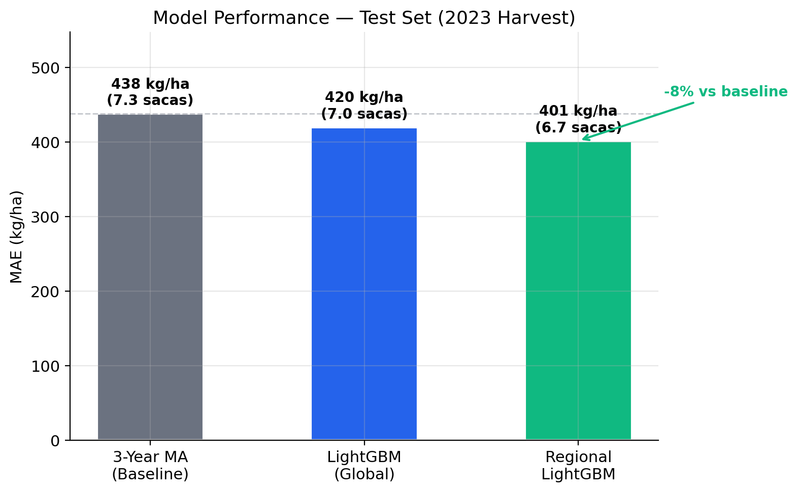
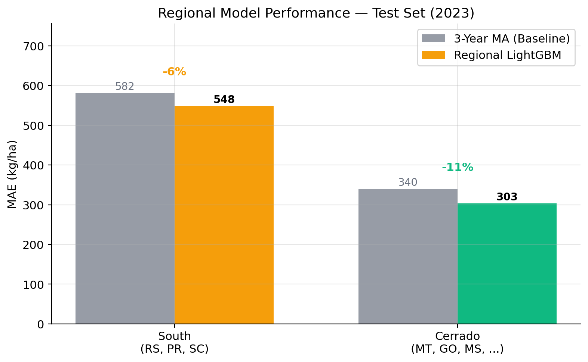
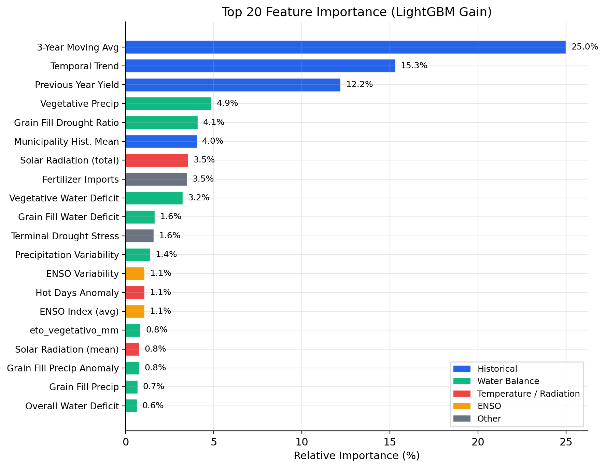
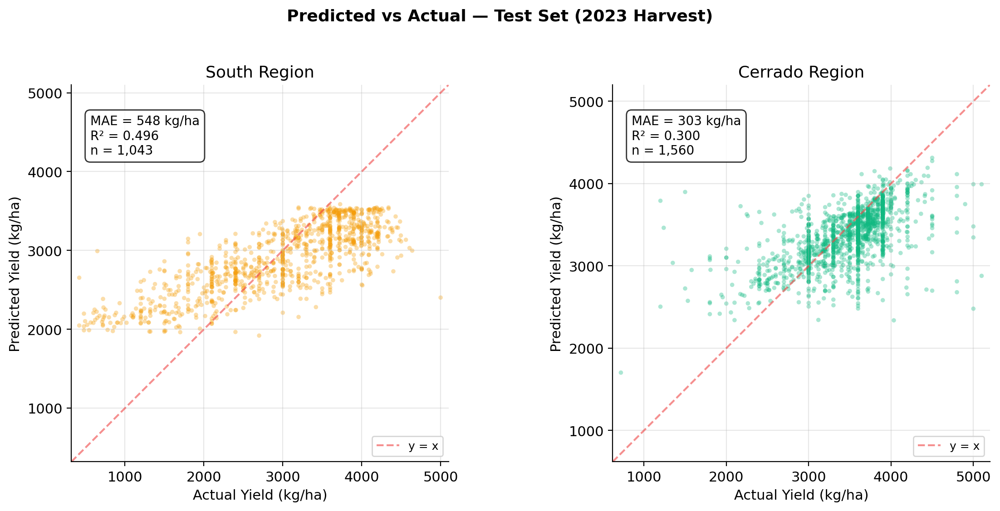
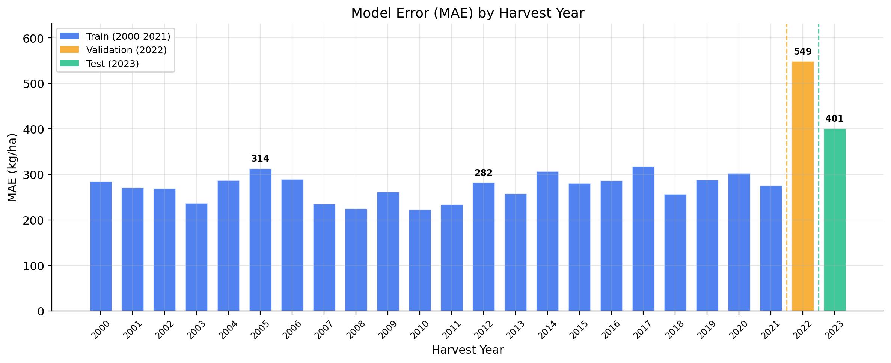

# Brazil Soybean Yield Forecast


## TL;DR

**Problem:** Agricultural cooperatives and credit banks need accurate municipality-level soybean yield estimates for crop insurance pricing, credit limits, and early warning of problematic harvests — but currently rely on subjective estimates or historical averages that ignore climate and regional variations.

**Solution:** End-to-end ML pipeline combining 9 public data sources (IBGE, NASA POWER, SoilGrids, ENSO, MapBiomas, and more) to predict yield in kg/ha with **MAE of 401 kg/ha (~6.7 bags/ha)**, validated across **8 independent harvest seasons** via temporal cross-validation, with conformal prediction intervals and automatic translation to credit risk language.

**Real-world proof:** predictions for the 2023/24 season were later confronted with the official IBGE PAM release (published ~18 months after the forecast window): **MAE 422 kg/ha, -17.6% vs the historical-average baseline, conformal coverage 83.9%/91.0% at 80%/90% nominal** — fully out-of-sample, reproducible via `python -m scripts.validate_against_pam`.

**Key Features:**
- Regional LightGBM models (South vs Cerrado), each trained on its own subpopulation
- 111 engineered features: water balance, soil interactions, ENSO teleconnections, municipality history, NDVI
- Expanding-window temporal CV (2016-2023): **MAE 419 +/- 57 kg/ha across 8 folds**
- Conformal prediction intervals, recalibrated against the current models
- DVC-orchestrated pipeline (20 stages) reproducible from a fresh clone
- Leakage guard executed inside the pipeline: historical features must be NaN when no past data exists, or the build aborts







---

## Results

### Model Performance vs Baseline

| Model | MAE (kg/ha) | MAE (sacas/ha) | vs Baseline |
|-------|-------------|----------------|-------------|
| 3-Year Moving Average (MA3) | 438 | 7.3 | baseline |
| LightGBM (Global, 111 features) | 420 | 7.0 | -4.1% |
| **Regional LightGBM** | **401** | **6.7** | **-8.3%** |

### Performance by Region

| Region | Baseline MAE | Model MAE | Improvement |
|--------|--------------|-----------|-------------|
| **South** (RS, PR, SC) | 582 kg/ha | 548 kg/ha | **-5.8%** |
| **Cerrado** (MT, GO, MS, etc.) | 340 kg/ha | 303 kg/ha | **-10.8%** |
| **Combined** | 438 kg/ha | 401 kg/ha | **-8.3%** |

*Test set: 2,603 municipality-year observations (2023 harvest season). Baseline computed on the same rows.*

### Temporal Cross-Validation (Expanding Window)

| Test Year | MAE (kg/ha) | MAPE (%) | n |
|-----------|-------------|----------|---|
| 2016 | 362 | 16.0 | 2,160 |
| 2017 | 444 | 14.3 | 2,275 |
| 2018 | 400 | 12.4 | 2,319 |
| 2019 | 393 | 16.4 | 2,369 |
| 2020 | 440 | 18.8 | 2,388 |
| 2021 | 362 | 11.7 | 2,472 |
| 2022 | 548 | 45.1 | 2,525 |
| 2023 | 401 | 16.5 | 2,603 |
| **Mean +/- Std** | **419 +/- 57** | **18.9** | |

*Each fold trains from scratch on years <= test_year - 2, validates on test_year - 1. The 2022 outlier is the historic La Nina drought in Rio Grande do Sul.*

### Out-of-Sample Validation: 2023/24 Season vs Official Data

The 2024 predictions were generated before IBGE published the official PAM figures. When the real data came out, the comparison (2,434 municipalities, `results/validation_real_2024.json`):

| Metric | Model | MA3 Baseline | lag1 Baseline |
|--------|-------|--------------|---------------|
| MAE (kg/ha) | **422** | 512 | 613 |
| vs MA3 | **-17.6%** | — | — |
| Bias | -20 kg/ha | — | — |

The gain over the baseline **doubled** relative to the 2023 test (-17.6% vs -8.3%): 2023/24 was an anomalous El Nino season with yield losses in the Cerrado — exactly where historical averages fail and climate features pay off. Observed conformal coverage: **83.9% at 80% nominal, 91.0% at 90%** — intervals held on data the model had never seen. Consistency across evaluations (CV 419, test 401, real-world 422) shows no overfitting to the development years.

### Conformal Prediction Coverage (test 2023)

| Nominal | South | Cerrado | Combined | Mean width |
|---------|-------|---------|----------|------------|
| 80% | 97.4% | 80.8% | 87.4% | 1,727 kg/ha |
| 90% | 99.6% | 90.6% | 94.2% | 2,193 kg/ha |

Cerrado coverage is close to nominal. The South over-covers because the calibration set (2022 validation year) was an extreme drought season with unusually large residuals — a documented limitation, not a feature. Lower bounds are clipped at zero.

### Feature Importance

Top drivers: previous-year yield (`lag1`, `MA3`), temporal trend and **municipality historical mean** account for ~50% of model gain. `mun_yield_hist_mean` captures the baseline productivity of each municipality (technology, soil management, farming maturity). In the South, vegetative-phase precipitation and water deficit at grain fill (`deficit_ratio_enchimento`) are the strongest climate signals.

---

## Quick Start

### Option 1: Quick Run (uses committed processed data)
```bash
git clone https://github.com/bruno-portfolio/Brazil-Soybean-Forecast.git
cd Brazil-Soybean-Forecast

python -m venv venv
venv\Scripts\activate  # Windows
# source venv/bin/activate  # Linux/Mac

pip install -e .
```

The processed datasets and trained models are included — the dashboard and inference work out of the box.

### Option 2: Reproduce the pipeline (DVC)
```bash
# Core pipeline: features -> baselines -> train -> conformal -> evaluate -> predict -> risk
dvc repro

# Or specific stages
dvc repro train_regional
dvc repro temporal_cv
```

**Note:** ingest stages are `frozen` because they hit external APIs (NASA POWER alone is ~550MB across 2,763 municipalities). Re-run them on demand: `dvc repro --force ingest_climate`.

### Run Dashboard
```bash
pip install -e ".[dashboard]"
streamlit run app/dashboard.py
```

---

## Architecture

```
Brazil-Soybean-Forecast/
├── dvc.yaml                       # Pipeline (20 stages: 10 ingest + 10 core)
├── configs/
│   ├── model.yaml                 # LightGBM hyperparameters
│   ├── split.yaml                 # Temporal train/val/test split
│   ├── features.yaml              # Feature engineering + regional phenology
│   └── ...                        # climate, soil, target, geo, ndvi
├── data/
│   ├── raw/                       # Raw API downloads (cached, gitignored)
│   └── processed/                 # Feature-engineered datasets (committed)
│       ├── dataset_final.parquet  # Main dataset (48K rows, 117 cols)
│       ├── climate_daily.parquet  # NASA POWER daily climate (gitignored, ~550MB)
│       └── ...                    # target, soil, ndvi, enso, new sources
├── src/
│   ├── ingest/                    # Data ingestion (9 sources)
│   ├── features/
│   │   └── build_features.py      # Feature engineering (111 features) + leakage guard
│   ├── common/                    # Shared between training and inference
│   │   ├── water_balance.py       # ETo (Hargreaves/Penman-Monteith FAO-56)
│   │   ├── phenology.py           # Regional phenological calendars
│   │   ├── conformal.py           # Conformal calibrator (zero-clipped lower bound)
│   │   ├── climate_aggregation.py # DuckDB-accelerated aggregation
│   │   └── new_source_features.py # Irrigation, fertilizer, insurance, land use
│   ├── modeling/
│   │   ├── train.py               # Global LightGBM (benchmark)
│   │   ├── train_regional.py      # South + Cerrado models (production)
│   │   ├── train_conformal.py     # Conformal prediction intervals
│   │   ├── baselines.py           # MA3 / lag1 baselines on the current split
│   │   └── split.py               # Temporal split with leak validation
│   ├── evaluation/                # Metrics, SHAP explainability
│   ├── inference/                 # predict.py — same feature code as training
│   ├── monitoring/                # Drift detection (PSI/KS)
│   └── business/                  # Credit risk translation
├── models/                        # Trained artifacts (committed: ~2MB total)
│   ├── model_sul.pkl              # South regional model
│   ├── model_cerrado.pkl          # Cerrado regional model
│   ├── conformal_sul.pkl          # Conformal calibrator (South)
│   ├── conformal_cerrado.pkl      # Conformal calibrator (Cerrado)
│   └── model_v2.pkl               # Global benchmark / fallback
├── results/                       # Evaluation outputs, predictions & plots
├── scripts/
│   ├── temporal_cv.py             # Expanding-window CV (8 folds)
│   └── update_pipeline.py         # In-season forecast with completeness flags
├── app/
│   └── dashboard.py               # Streamlit dashboard (reads results/, no hardcoded metrics)
└── tests/                         # Unit tests (incl. anti-leakage suite)
```

---

## Features (111 total)

### Climate Features (by phenological phase)
| Category | Count | Examples |
|----------|-------|----------|
| Temperature | 12 | `tmean_plantio`, `tmax_vegetativo`, `hot_days_enchimento` |
| Precipitation | 11 | `precip_total_mm`, `dry_spell_max`, `precip_cv` |
| Evapotranspiration | 7 | `eto_total_mm`, `eto_plantio_mm`, `eto_enchimento_mm` |
| Water Deficit | 6 | `deficit_plantio_mm`, `deficit_ratio_enchimento`, `water_deficit_ratio` |
| Radiation | 2 | `radiation_total`, `radiation_mean` |
| GDD | 5 | `gdd_accumulated`, `gdd_plantio`, `gdd_vegetativo` |

### Soil Features (16)
| Feature | Description |
|---------|-------------|
| `clay_0_30cm`, `sand_0_30cm`, `silt_0_30cm` | Texture composition (0-30cm and 30-100cm) |
| `phh2o_0_30cm` | Soil acidity |
| `soc_0_30cm`, `nitrogen_0_30cm` | Organic matter |
| `awc_estimated` | Available Water Capacity |
| `cec_0_30cm` | Cation Exchange Capacity |
| `soil_quality_index` | Composite soil quality |

### ENSO & Climate Indices (6)
| Feature | Description |
|---------|-------------|
| `oni_avg`, `oni_std` | Oceanic Nino Index over the crop window (Oct-Mar) |
| `is_la_nina`, `is_el_nino` | Binary ENSO flags |

### Historical & Municipality Identity (5)
| Feature | Description |
|---------|-------------|
| `produtividade_lag1` | Previous year yield (shift per municipality) |
| `produtividade_ma3` | 3-year moving average (shift + rolling per municipality) |
| `trend` | Temporal trend (technological progress) |
| `mun_yield_hist_mean` | Expanding historical mean yield per municipality (shifted, min 3 years) |
| `mun_yield_volatility` | Historical yield coefficient of variation per municipality |

All historical features are validated by `validate_no_leakage`, which aborts the pipeline if any of them has a value on a municipality's first observed year.

### NDVI Vegetation Index (9)
| Feature | Description |
|---------|-------------|
| `ndvi_mean_safra` | Mean NDVI for entire growing season |
| `ndvi_max_safra`, `ndvi_min_safra` | Peak and minimum vegetation vigor |
| `ndvi_amplitude` | Seasonal NDVI range |
| `ndvi_plantio`, `ndvi_vegetativo`, `ndvi_enchimento` | NDVI by phenological phase |
| `ndvi_x_precip_deficit` | NDVI x precipitation anomaly interaction |
| `ndvi_ench_x_la_nina` | Grain-fill NDVI under La Nina stress |

### New Data Sources (4)
| Feature | Source | Description |
|---------|--------|-------------|
| `pct_irrigado` | ANA | % irrigated area (static snapshot — see limitations) |
| `fert_import_ton` | ComexStat | Fertilizer imports by state |
| `sinistro_rate_3yr` | MAPA PSR | 3-year insurance loss rate (previous years only) |
| `pct_soja` | MapBiomas | Soybean land use fraction |

### Interactions & Anomalies (19)
Climate anomalies (expanding window, shifted — no current-year information), ENSO interactions (`la_nina_x_deficit`, `terminal_drought_stress`), soil-climate interactions (`awc_x_deficit`, `sand_x_drought`), regional interactions (`sul_x_la_nina`), and source interactions (`irrigacao_x_deficit`, `fert_x_precip`).

---

## Model Details

### Regional LightGBM Architecture

```
                    +------------------+
                    |   Input Data     |
                    |  (111 features)  |
                    +--------+---------+
                             |
              +--------------+--------------+
              |                             |
              v                             v
    +------------------+          +------------------+
    |   South Model    |          |  Cerrado Model   |
    |  (PR, SC, RS)    |          | (MT, GO, MS...)  |
    |                  |          |                  |
    |   LightGBM       |          |   LightGBM       |
    +--------+---------+          +--------+---------+
             |                             |
             +-------------+---------------+
                           v
                  +------------------+
                  |   Predictions    |
                  |    (kg/ha)       |
                  +------------------+
                           |
                           v
                  +------------------+
                  |    Conformal     |
                  |   Calibration    |
                  | (80%/90% bands)  |
                  +------------------+
```

### Why Regional Models?

1. **Climate Variability**: South Brazil has higher inter-annual variability due to La Nina/El Nino
2. **Different Yield Distributions**: Cerrado has higher, more stable yields; South has a wider range
3. **Specialization via data, not hyperparameters**: both models share the same LightGBM configuration; the gain comes from each model fitting its own region's climate-yield relationship (early stopping picks ~45 trees for the volatile South vs ~106 for the Cerrado)

---

## Data Sources

| Source | Data | Granularity | Auth |
|--------|------|-------------|------|
| [IBGE/SIDRA](https://sidra.ibge.gov.br/) | Soybean yield & area | Municipality x Year | No |
| [NASA POWER](https://power.larc.nasa.gov/) | Daily climate (temp, precip, radiation, wind) | Point x Day | No |
| [ISRIC SoilGrids](https://soilgrids.org/) | Soil properties | 250m raster | No |
| [NOAA ONI](https://www.cpc.ncep.noaa.gov/) | El Nino/La Nina index | Monthly | No |
| [ANA](https://dadosabertos.ana.gov.br/) | Irrigation pivot locations | Point | No |
| [ComexStat](http://comexstat.mdic.gov.br/) | Fertilizer imports by state | State x Month | No |
| [MAPA PSR](https://www.gov.br/agricultura/) | Crop insurance claims | Municipality x Year | No |
| [MapBiomas](https://mapbiomas.org/) | Soybean land use extent | 30m raster | No |
| [MODIS/GEE](https://earthengine.google.com/) | NDVI vegetation index | Pixel x 16-day | GEE account |

Most ingestion uses [agrobr](https://github.com/bruno-portfolio/agrobr) for the Brazilian sources.

---

## Train/Test Split

| Set | Years | Samples | Purpose |
|-----|-------|---------|---------|
| **Train** | 2000-2021 | 43,019 | Model training |
| **Validation** | 2022 | 2,525 | Early stopping (La Nina stress test) |
| **Test** | 2023 | 2,603 | Final evaluation |

*Strictly temporal split — no future information leaks into training. Historical features use shift + expanding windows per municipality, enforced by an in-pipeline validation that fails the build on violation.*

Additionally, **expanding-window temporal CV** validates the model across 8 independent test years (2016-2023), training from scratch for each fold.

---

## Known Limitations

1. **Annual PAM Data Lag**: IBGE publishes ~18 months after harvest. Ex-post predictions for 2024/2025 use observed climate, but their `lag1`/`ma3` features fall back to the latest published PAM year — this is recorded in `predictions_metadata.json`.

2. **NASA POWER is Satellite-Derived**: climate is interpolated to the municipality centroid; large municipalities may have representativeness errors.

3. **Conformal calibration on a single extreme year**: the calibration set (2022) was a historic drought in the South, so South intervals over-cover (97% at 80% nominal) and are wide. Calibrating on multiple years (e.g. CV+ style) is the known fix and is on the roadmap.

4. **Static infrastructure snapshots**: `pct_irrigado` (ANA pivots) and soil properties are current snapshots applied to all years — irrigation built in 2015 "exists" in 2005 in the training data.

5. **Technological Drift**: new cultivars and practices cause drift not captured by the model. Annual retraining recommended.

6. **In-season forecasts are flagged, not silent**: `scripts/update_pipeline.py` marks predictions with `clima_completo=False` / `enso_disponivel=False` when the phenological window or the ONI series is incomplete, instead of silently treating missing months as zero-rain.

---

## Changelog

### v3.1 (Current)
- **Out-of-sample validation against reality**: 2023/24 predictions confronted with the official PAM release — MAE 422 kg/ha, -17.6% vs baseline, conformal coverage near nominal (`scripts/validate_against_pam.py`)
- **Fix: cross-municipality leakage in `produtividade_ma3`** (rolling window crossed municipality boundaries on the flat series; ~11% of training rows affected). Model improved after the fix: test MAE 409 -> 401, CV mean 429 -> 419
- **Fix: `sinistro_rate_3yr` included the current year** (outcome leakage); now shifted to previous years only
- **Fix: Hargreaves ETo missing the 0.408 radiation conversion** (FAO-56); inference now uses the same radiation-aware climate file as training (Penman-Monteith)
- Inference rebuilt: computes all 111 features (NDVI + municipality identity) with the same code as training; no more median imputation skew; conformal lower bounds clipped at 0
- Conformal recalibrated against current models; coverage reported per nominal level
- `validate_no_leakage` now covers all historical features and aborts the pipeline on violation
- Single prediction path (regional models) for both ex-post and in-season scripts; in-season output carries completeness flags
- DVC pipeline actually reproducible: real outputs declared, full dependency graph, models versioned in git
- Dashboard reads every metric from `results/` (no hardcoded numbers from older model generations)
- Removed dead experiments (quantile models with 50% coverage, stacking ensemble) and stale artifacts

### v3.0
- 111 features: municipality identity (`mun_yield_hist_mean`, `mun_yield_volatility`), NDVI from MODIS
- Expanding-window temporal cross-validation across 8 harvest seasons (2016-2023)
- LightGBM native NaN handling in training

### v2.0
- Regional LightGBM models (South vs Cerrado)
- 100 features: water balance, soil interactions, new data sources (SoilGrids, ANA, ComexStat, MAPA PSR, MapBiomas)
- Conformal prediction intervals, DVC pipeline, CI with GitHub Actions

### v1.0
- Single LightGBM model (76 features), climate + ENSO + historical features, Streamlit dashboard

---

## Installation

### Requirements
- Python 3.10+
- 4GB RAM minimum
- ~2GB disk space for data

### Install
```bash
pip install -e .                # core
pip install -e ".[dev]"        # + tests, lint
pip install -e ".[dashboard]"  # + streamlit, plotly
```

---

## License

MIT License - see [LICENSE](LICENSE) for details.

---

## Author

Bruno - [GitHub](https://github.com/bruno-portfolio) | [LinkedIn](https://www.linkedin.com/in/bruno-escalhao-32a41934b/)

---

## Citation

```bibtex
@software{brazil_soybean_forecast,
  author = {Bruno},
  title = {Brazil Soybean Yield Forecast},
  year = {2026},
  url = {https://github.com/bruno-portfolio/Brazil-Soybean-Forecast}
}
```
